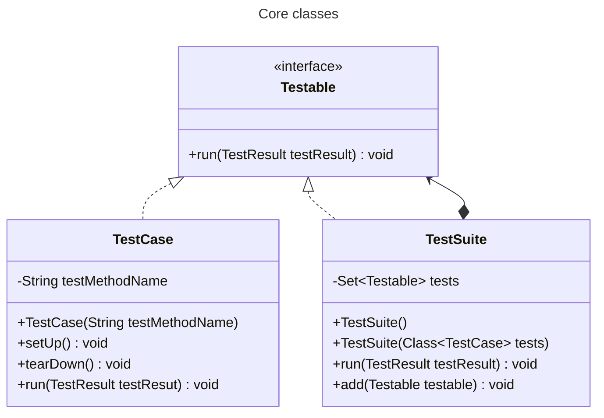
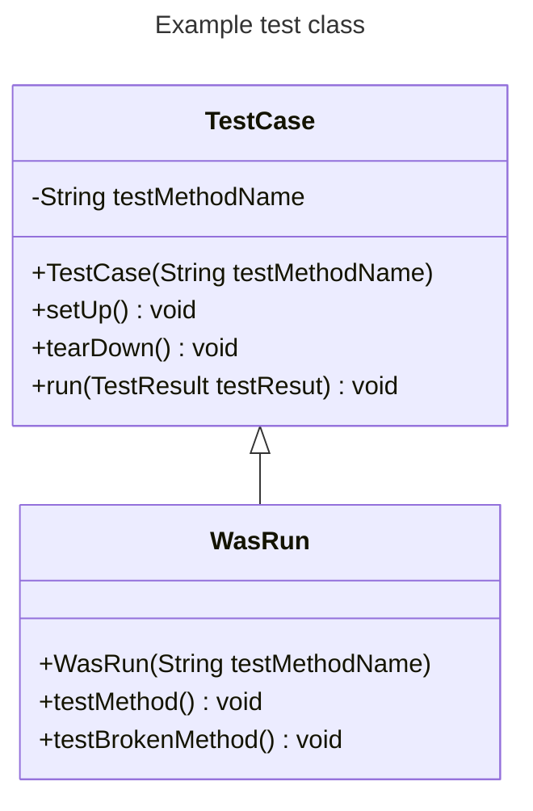

# xUnit TDD

This project is a TDD implementation of the xUnit testing framework using plain Java.

## How to run

You can simply run the test and see the result by running `main` method
in [`src/test/XUnitTest.java`](./src/test/XUnitTest.java).

### Supported features

This framework supports following features:

- [x] Run testable method
    - [x] Support annotation based test
    - [ ] Throw exception if test method is not found
- [x] Run setUp() before testable method
    - [x] Must be run before each testable method
- [x] Run tearDown() after testable method
    - [ ] Must be run even if the testable method fails
- [x] Collect testable results
    - [ ] Collect failed test method names and causes.
- [x] Run TestSuite a collection of testable cases and testable suites
    - [x] Collect testable cases
    - [x] Collect testable suites

## Introduction

### What is different from JUnit?

JUnit create test class at once and run all test methods. But this project create each instance for running each test.
So in this case, you can run test class separately, for example, you don't have to care about that field value is
changed by others and affect other test method. But it is not good for performance and doesn't use properly `setUp()`
and `tearDown()` which is designed for invoking before and after each test method.

### Class diagram

Create your test class like JUnit inheriting `TestCase` class. For instance, it is implemented as `WasRun` class in this
project.

The `testMethod()` and `testBrokenMethod()` of `WasRun` can be to test. You can specify the test
method name with
the `testMethodName` parameter of the `TestCase` constructor. Then `run()` method will run the test method and collect
test result.

## Implementation environment

Java 17

## References

- [Test-Driven Development: By Example](https://www.yes24.com/Product/Goods/12246033)
- [xUnit 테스팅 프레임워크를 TDD로 만들어보자](https://www.youtube.com/watch?v=tdKFZcZSJmg)
- [테스팅 프레임워크는 직접 만들어 써보자](https://toby.epril.com/5)
